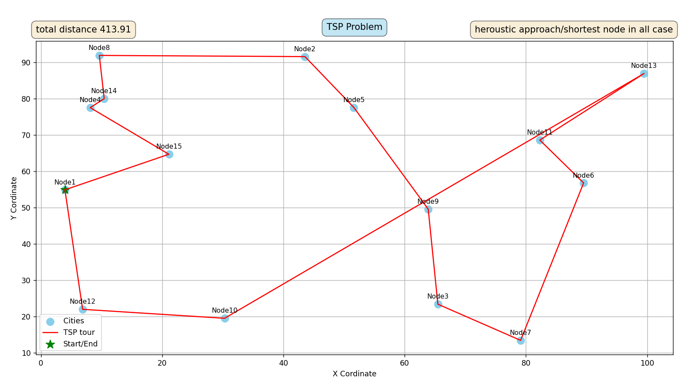

## HOMEWORK SERIES

## HOMEWORK - 1 -

# TSP Solver using Nearest Neighbor Heuristic

This project is an implementation of a solution for the Traveling Salesman Problem (TSP) for Assignment 1 of the "AI in Computer Games" course. It generates a random set of points, applies the Nearest Neighbor heuristic to find a short tour, and visualizes the result.

## Problem Definition

The goal of the Traveling Salesman Problem (TSP) is to find the shortest possible route that visits a set of given locations (cities) exactly once and returns to the starting point.

## Our Solution

### 1. Graph Generation

The problem is modeled as a fully connected graph where nodes represent cities and edge weights represent the Euclidean distance between them.

- The graph is generated with a specified number of nodes placed randomly in a 2D area.
- To ensure the experiments are repeatable, the random generation process is based on a fixed seed.

### 2. Heuristic Used: Nearest Neighbor

To find a solution, we implemented a simple and intuitive greedy algorithm known as the **Nearest Neighbor** heuristic. The algorithm works as follows:

1.  Start at an arbitrary node (city).
2.  From the current node, move to the nearest unvisited node.
3.  Repeat step 2 until all nodes have been visited.
4.  Finally, return to the starting node to complete the tour.

### 3. Visualization

The final tour is visualized using the `matplotlib` library. The output shows all the nodes and the path taken by the salesman.

## How to Run

1.  Ensure you have Python and `matplotlib` installed.
2.  Run the script from your terminal:
    ```bash
    python hw1.py
    ```
    or
    ```bash
    python hw1WithOutNetworkx.py
    ```

## Example Output

Here is a screenshot of a generated tour for 15 cities:

## 
